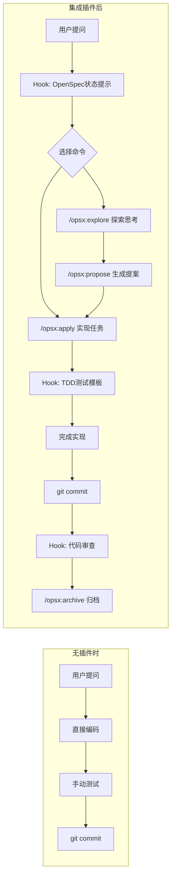

# wps-claude-plugin

Claude Code 插件，集成 OpenSpec 工作流。

## 插件集成前后对比

### Commands

| 命令 | 用途 |
|------|------|
| `/opsx:explore` | 探索问题，不写代码 |
| `/opsx:propose` | 创建变更提案 |
| `/opsx:apply` | 实现任务清单 |
| `/opsx:archive` | 归档变更 |
| `/code-review` | 代码审查 |
