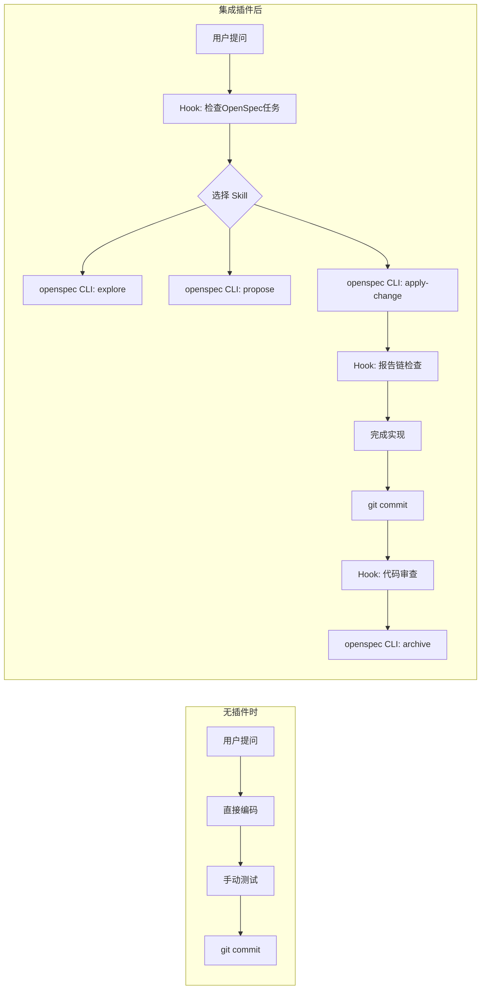

# wps-claude-plugin

Claude Code 插件，集成 OpenSpec 工作流。

## 架构：瘦插件 + 报告驱动门禁

本插件采用"瘦插件"架构：
- **OpenSpec CLI** 是 Skill 的唯一来源
- **插件提供 Hooks** 实现报告驱动门禁
- **无内嵌 Skills** - 通过 CLI 直接调用



### Skills (via OpenSpec CLI)

| Skill | 用途 |
|-------|------|
| `openspec-explore` | 探索问题，不写代码 |
| `openspec-propose` | 创建变更提案 |
| `openspec-apply-change` | 实现任务清单 |
| `openspec-archive-change` | 归档变更 |

### Plugin Skills

| Skill | 用途 |
|-------|------|
| `code-review` | 代码审查 |

## 报告驱动门禁

每个 SDD 步骤产出 JSON 报告：

```
openspec/changes/<name>/reports/
├── task-1_scope.json       (test-scope.py --save-report)
├── task-1_skeleton.json    (test-generator.py --save-report)
├── task-1_lint.json        (lint-runner.py --save-report)
├── task-1_scoped-test.json (test-runner.py --save-report)
├── full-test.json          (全量测试)
└── code-review.json        (代码审查)
```

Hook 检查报告链确保流程完整性：
- **commit 时**: 当前任务报告链完整？
- **archive 时**: 所有任务报告链 + full-test + code-review 完整？

## 安装

```bash
# 安装 OpenSpec CLI
npm install -g openspec-cli

# 插件会在 SessionStart 时检测并提示安装
```
