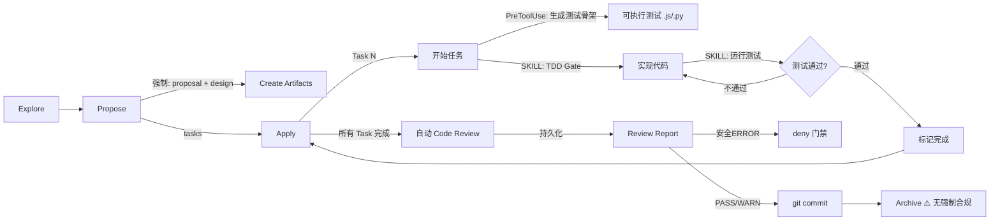
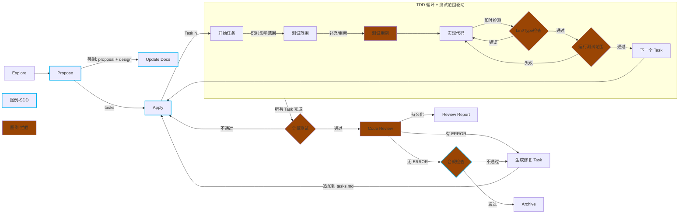

# 当前状态分析

> 分析日期: 2026-05-07
> 上次更新: 2026-04-30

## 1. 插件架构概览

```
wps-claude-plugin/
├── plugin/
│   ├── skills/                    # 5 个 skill
│   │   ├── openspec-explore/      # 探索阶段：思考伙伴
│   │   ├── openspec-propose/      # 提案阶段：生成 proposal/tasks
│   │   ├── openspec-apply-change/ # 实现阶段：执行 task 清单
│   │   ├── openspec-archive-change/# 归档阶段：同步 spec 到 main
│   │   └── code-review/           # 代码审查：检查 staged changes
│   ├── hooks/                     # 4 个 hook
│   │   ├── on-user-prompt.py      # UserPromptSubmit: 报告活跃 change
│   │   ├── pre-tool-openspec-test.py # PreToolUse(Write/Edit): 生成测试模板
│   │   ├── pre-tool-commit-review.py  # PreToolUse(Bash): 建议 review
│   │   └── session-start-worktree.py  # SessionStart: 检测 worktree 状态
│   └── agents/
│       └── code-review.md         # Review agent 定义
└── demo-project/                  # 演示项目
    └── openspec/changes/add-user-auth/
        ├── proposal.md            # 需求定义
        ├── tasks.md               # 任务清单 (10/10 完成)
        └── test-reports/
            └── test-cases-add-user-auth.md  # 自动生成的测试模板
```

## 2. 当前能力评估

### 2.1 SDD (Spec-Driven Development)

| 维度 | 评分 | 说明 |
|------|------|------|
| 规范定义 | ★★★★ | ✅ proposal.md + design.md 均生成 (openspec-propose 已实现) |
| 任务分解 | ★★★★ | tasks.md 任务清单，支持勾选跟踪 |
| 实现追溯 | ★★★☆ | apply-change skill 按 task 顺序实现，但无偏差检测 |
| 归档同步 | ★★★☆ | archive 同步 spec 到 main，但合规检查为软约束 |

**断裂点：**
- ~~Propose 阶段不强制 design.md~~ ✅ 已修复
- Apply 时发现设计问题只能"建议更新"，无强制同步
- Archive 前合规检查仅警告不阻断

### 2.2 TDD (Test-Driven Development)

| 维度 | 评分 | 说明 |
|------|------|------|
| 测试模板生成 | ★★★★ | ✅ 生成可执行测试骨架 (Jest/Vitest/pytest) |
| 测试先行约束 | ★★★☆ | ✅ SKILL.md 内嵌 TDD Gate，但非 Hook 层强制 |
| 测试增量更新 | ★★★★ | ✅ 支持增量生成，不覆盖已有测试 |
| 测试执行验证 | ★★★☆ | ✅ SKILL.md 要求运行测试，但无全量测试门禁 |

**已实现文件：**
- `plugin/hooks/pre-tool-openspec-test.py` — 生成可执行测试骨架
- `plugin/utils/test-framework.py` — 检测测试框架
- `plugin/utils/test-runner.py` — 运行测试并解析结果
- `plugin/templates/test-jest.js` / `test-pytest.py` — 测试骨架模板

**断裂点：**
- ~~生成模板非可执行~~ ✅ 已修复
- 测试先行约束为软约束（SKILL.md 内嵌，Claude 可选择跳过）
- ~~完成 task 后不要求测试通过~~ ✅ 已修复（SKILL.md 要求测试通过）
- 缺少类型/Lint 检查集成
- 缺少全量测试门禁（所有 Task 完成后）

### 2.3 Code Review

| 维度 | 评分 | 说明 |
|------|------|------|
| 自动触发 | ★★★★ | ✅ apply-change 完成后自动触发 code-review Agent |
| 审查范围 | ★★★☆ | ✅ staged + unstaged changes，无架构级审查 |
| 审查深度 | ★★★★ | ✅ 逻辑错误/null处理/安全/冗余逻辑 |
| 结果持久化 | ★★★★ | ✅ 结果写入 test-reports/code-review-*.md |

**已实现文件：**
- `plugin/skills/openspec-apply-change/SKILL.md` — Step 7 自动 Review
- `plugin/agents/code-review.md` — Review Agent 定义
- `plugin/hooks/pre-tool-commit-review.py` — Review 门禁 + 多次追溯
- `plugin/templates/code-review-report.md` — Review 报告模板

**断裂点：**
- ~~commit 前只建议不执行~~ ✅ 已修复（SKILL.md 自动触发）
- ~~Review 结果不持久化~~ ✅ 已修复
- 安全问题 deny 门禁 ✅ 已实现
- 无 SDD 合规审查（实现是否符合 proposal scope）

## 3. 流程图：现状 vs 目标

### 3.1 当前流程（半硬约束）

> 更新于 2026-05-07：Phase 1/2 核心功能已实现



### 3.2 目标流程（自动闭环）



## 4. 核心问题清单

### P0 问题（阻塞性）

| ID | 问题 | 影响 | 状态 |
|----|------|------|------|
| P0-1 | TDD 无强制执行 | ~~可跳过测试直接实现~~ SKILL 内嵌软约束 | ⚠️ 部分修复 |
| P0-2 | Review 不自动执行 | ~~质量审查依赖 Claude 自觉~~ | ✅ 已修复 |
| P0-3 | 无测试运行验证 | ~~测试过不过不知道~~ SKILL 要求运行测试 | ⚠️ 部分修复 |

**剩余 P0 问题：**
- TDD 约束为软约束（SKILL.md 指令，非 Hook 层强制）
- 缺少类型/Lint 检查门禁
- 缺少全量测试门禁（所有 Task 完成后）

### P1 问题（重要）

| ID | 问题 | 影响 | 状态 |
|----|------|------|------|
| P1-1 | ~~测试模板非可执行~~ | ~~需要手写测试骨架~~ | ✅ 已修复 |
| P1-2 | Archive 合规检查为软约束 | 不验证 proposal 是否完整实现 | ⚠️ 部分修复 |
| P1-3 | ~~Review 结果不持久化~~ | ~~无法追溯历史审查记录~~ | ✅ 已修复 |

### P2 问题（增强）

| ID | 问题 | 影响 | 状态 |
|----|------|------|------|
| P2-1 | ~~无 design.md 强制~~ | ~~缺少技术设计文档~~ | ✅ 已修复 |
| P2-2 | 无偏差检测 | 实现可能偏离 proposal | ❌ 未修复 |
| P2-3 | 无流水线编排 | 各阶段独立触发，无端到端自动化 | ❌ 未修复 |

## 5. 技术约束

### 5.1 Claude Code Hook 限制

| Hook 事件 | 支持 | 说明 |
|-----------|------|------|
| UserPromptSubmit | ✓ | 用户输入前触发 |
| PreToolUse | ✓ | 工具调用前触发，可 allow/deny |
| PostToolUse | ✗ | 当前版本不支持（2026-04） |
| SessionStart | ✓ | 会话启动时触发 |
| SessionEnd | ✗ | 当前版本不支持 |

**关键约束：**
- PostToolUse 不支持 → 无法在 Write 完成后立即触发测试
- PreToolUse 只能 allow/deny → 无法强制执行额外操作
- Hook 只能注入 context → 实际执行依赖 Claude 决策

### 5.2 解决策略（已实现）

1. **在 Skill 层面补偿** ✅：
   - `openspec-apply-change/SKILL.md` 内嵌 TDD Gate + Auto Review
   - 每个 Task 完成前要求运行测试
   - 所有 Task 完成后自动触发 Code Review Agent

2. **使用 Agent 工具** ✅：
   - Step 7 使用 `Agent tool` 调用 `wps-claude-plugin:code-review`
   - Review 结果自动持久化到 `test-reports/`

3. **Git Hook 补充** ✅：
   - `pre-tool-commit-review.py` 作为最后一道防线
   - 安全问题 deny 门禁生效
   - 支持多次 Review 追溯

4. **可执行测试生成** ✅：
   - `pre-tool-openspec-test.py` 生成 Jest/Vitest/pytest 测试骨架
   - `test-framework.py` 检测项目测试框架
   - 支持增量更新，不覆盖已有测试

**未实现策略：**
- 类型/Lint 检查集成（eslint, mypy）
- 全量测试门禁
- Archive 前强制合规检查（C1-C10）
- 端到端流水线编排（openspec-pipeline）
- Spec 合规审查（C9-C10）

## 6. 自动闭环策略

### 6.1 核心理念

**问题**：Review 发现 ERROR 传统做法是 deny 阻断，需要人为干预。
**解决**：所有 ERROR 生成新的 task，追加到 tasks.md，重新进入 apply 循环，形成自动闭环。

```
当前: [实现] → [Review] → ❌ ERROR → deny → 人为干预
优化: [实现] → [Review] → ⚠️ ERROR → 生成修复 Task → 继续实现 → 循环直到无 ERROR
```

### 6.2 策略矩阵

| 策略 | 触发时机 | 行为 | 目标 |
|------|---------|------|------|
| 前移检测 + 即时修复 | 每个 task 完成后 | Lint/Type 自动修复 | 减少进入 Review 的错误 |
| ERROR → 新 Task | Review 检测到任意 ERROR | 生成修复 task，重入 apply | 完全消除阻断 |
| 循环收敛 | 修复 task 完成后重新 Review | 最多 3 轮，否则提示人工介入 | 防止无限循环 |

### 6.3 流程闭环

```
Propose (生成 tasks.md)
    ↓
Apply (执行 tasks)
    ↓
Review (检测问题)
    ├─ 无 ERROR → Archive ✓
    └─ 有 ERROR → 生成修复 tasks → 追加到 tasks.md → 重新 Apply
                                          ↓
                                      Review
                                          ↓
                                      无 ERROR → Archive ✓
```

### 6.4 Task 生成规则

Review 发现的每个 ERROR 生成一个 task：

```markdown
- [ ] Fix: <ERROR 描述> (<file>:<line>)
  - Category: <Logical/Security/NullHandling/...>
  - Current: <问题代码片段>
  - Suggested: <修复建议>
```

示例：
```markdown
- [ ] Fix: SQL injection vulnerability in user lookup (auth.js:67)
  - Category: Security
  - Current: `query("SELECT * FROM users WHERE id=" + id)`
  - Suggested: Use parameterized query `query("SELECT * FROM users WHERE id=$1", [id])`
```

### 6.5 循环收敛机制

防止无限循环：

| 轮次 | 行为 |
|------|------|
| 第 1 轮 Review | ERROR → 生成修复 task → 继续 |
| 第 2 轮 Review | ERROR → 生成修复 task → 继续 |
| 第 3 轮 Review | 仍有 ERROR → **提示人工介入**，暂停流程 |

### 6.6 预期效果

- **当前阻断率**: ~30%（ERROR 导致 deny）
- **优化后阻断率**: <1%（仅剩 3 轮后仍有 ERROR 的极端情况）
- **人为干预频率**: 从每 3-4 次 commit 一次干预 → 极少需要干预
- **平均修复轮次**: 1-2 轮 Review 即可通过